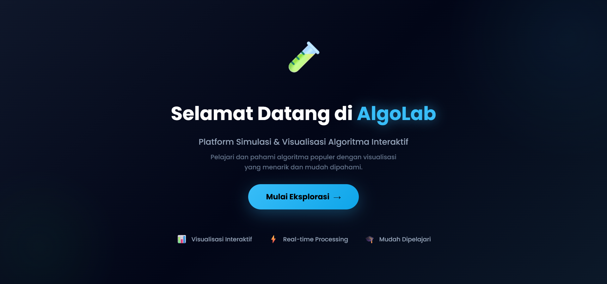
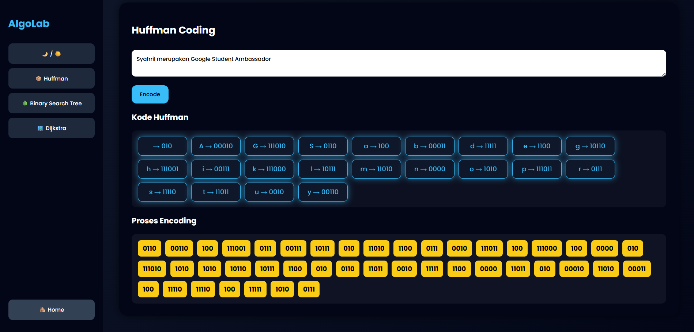
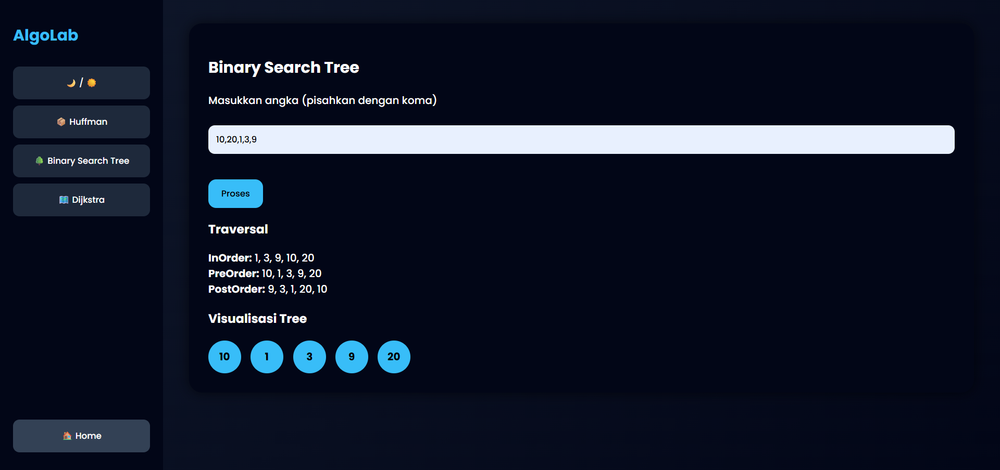
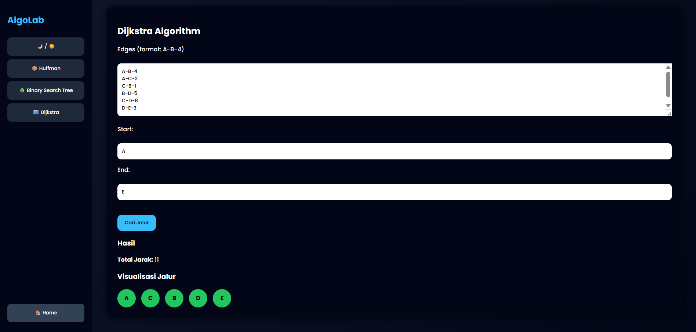

# 🧠 AlgoLab Web Simulator Algoritma

<div align="center">

**Ujian Akhir Semester – Algoritma Pemrograman**  
🏛️ **Universitas Muhammadiyah Malang**  
📅 **Tahun Akademik 2026**

</div>

---

## 👥 Anggota Kelompok

<div align="center">

| Nama                     | NIM             |
|--------------------------|-----------------|
| Muhamad Robi Ardita      | 202410370110002 |
| Syahrial Nur Faturrahman | 202410370110009 |
| Farid Al Farizi          | 202410370110017 |
| Naufal Arkaan            | 202410370110020 |

</div>

---

## 📜 Deskripsi Proyek
AlgoLab Web Simulator Algoritma adalah sebuah **platform pembelajaran dan simulasi algoritma berbasis web** yang dikembangkan sebagai Project UAS mata kuliah Algoritma Pemrograman.  
Platform ini bertujuan untuk membantu pengguna memahami konsep algoritma melalui simulasi dan visualisasi interaktif, sehingga pengguna dapat memasukkan data secara langsung dan melihat proses serta hasil kerja algoritma secara bertahap.

Proyek ini mengimplementasikan beberapa studi kasus algoritma yang telah ditentukan dalam ketentuan UAS dan disajikan dalam satu sistem terpadu.

---

## 🎯 Tujuan Pembuatan
- Memenuhi tugas Project UAS mata kuliah Algoritma Pemrograman
- Membantu pengguna memahami alur kerja dan logika algoritma
- Menyediakan media pembelajaran algoritma yang interaktif
- Mengimplementasikan konsep algoritma ke dalam sebuah platform simulasi berbasis web

---

## 🧩 Studi Kasus Algoritma
Platform ini mengimplementasikan beberapa **studi kasus algoritma** yang digunakan sebagai media simulasi dan pembelajaran, yaitu:
1. **Huffman Coding** – Algoritma kompresi data yang bekerja berdasarkan frekuensi kemunculan karakter.
2. **Binary Search Tree (BST)** – Struktur data pohon biner terurut yang mendukung proses pencarian dan traversal data, meliputi:
   - InOrder  
   - PreOrder  
   - PostOrder  
3. **Algoritma Dijkstra** – Algoritma untuk menentukan jalur terpendek dari satu simpul ke simpul lain pada graf berbobot. 

---

## ⚙️ Fitur Platform
- Platform berbasis web yang interaktif
- Input data algoritma langsung oleh pengguna
- Simulasi dan visualisasi hasil algoritma secara real-time
- Mendukung beberapa algoritma dalam satu platform

---

## 🖥️ Teknologi yang Digunakan

<div align="center">

### 🔧 Backend


<br/><br/>

### 🎨 Frontend


</div>

---

## 📂 Struktur Project

```text
AlgoLab-Web-Simulator-Algoritma/
├── backend/
│   ├── app.py
│   ├── bst.py
│   ├── dijkstra.py
│   └── huffman.py
├── frontend/
│   ├── static/
│   │   ├── style.css
│   │   └── script.js
│   └── templates/
│       └── index.html
├── image/
│   ├── home.png
│   ├── pilih-algoritma.png
│   ├── huffman.png
│   ├── bst.png
│   └── dijkstra.png
├── venv/
├── requirements.txt
└── README.md
````

---

## 📸 Tampilan Antarmuka Platform

### 🏠 Halaman Utama



### 📊 Menu Pemilihan Algoritma


### 🔐 Huffman Coding



### 🌳 Binary Search Tree



### 🗺️ Algoritma Dijkstra



---

## ▶️ Cara Menjalankan Platform

### 🌐 Menjalankan Platform (Online)

Platform dapat diakses secara langsung melalui:

```
https://algolab.pythonanywhere.com/
```

---

### 💻 Menjalankan Platform Secara Lokal

1. Clone repository ini
2. Masuk ke folder project
3. Buat virtual environment:

```bash
python -m venv venv
```

4. Aktifkan virtual environment:

* Windows:

```bash
venv\Scripts\activate
```

* Linux / macOS:

```bash
source venv/bin/activate
```

5. Install dependency:

```bash
pip install -r requirements.txt
```

6. Jalankan Platform:

```bash
python backend/app.py
```

7. Buka browser dan akses:

```
http://localhost:5000
```

---

## 📌 Catatan

Platform ini dikembangkan untuk keperluan **akademik dan pembelajaran**.
Server Flask yang digunakan merupakan **development server**.

---
